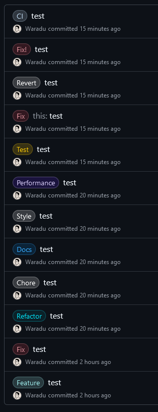

### How to commit:

1. most important: good commit message
2. use prefixes
2. write lowercase, reference pr's and do not add a dot at the end

why prefixes?

looks better and helps searchign commits faster

`fix: test` 
 

`fix(this): test` 
 

example commit message with prefix: `fix: wrong api url`
 
add "!" at the end if it's a breaking change (not backwards compatible): `fix!: xxx`

prefixes:

- `fix`: Bug fix
- `feat`: a new feature or enhancement
- `chore`: updating dependencies or setting up build tools etc
- `ci`: change to CI like GitHub Actions
- `refactor`: code refactoring without adding new features or fixing bugs
- `docs`: documentation-only changes (README etc)
- `style`: changes related to formatting such as code style adjustments, and whitespace changes (not css changes)
- `perf`: performance improvements without changing existing functionality
- `test`: unit tests etc
- `revert`: revert a commit

scoped prefixes (optional):

- `fix(scope): xxx`
- `fix(css): invisible button`
- `feat(auth): add OAuth support`
- `fix(api): handle null response error`
- `docs(readme): update installation instructions`